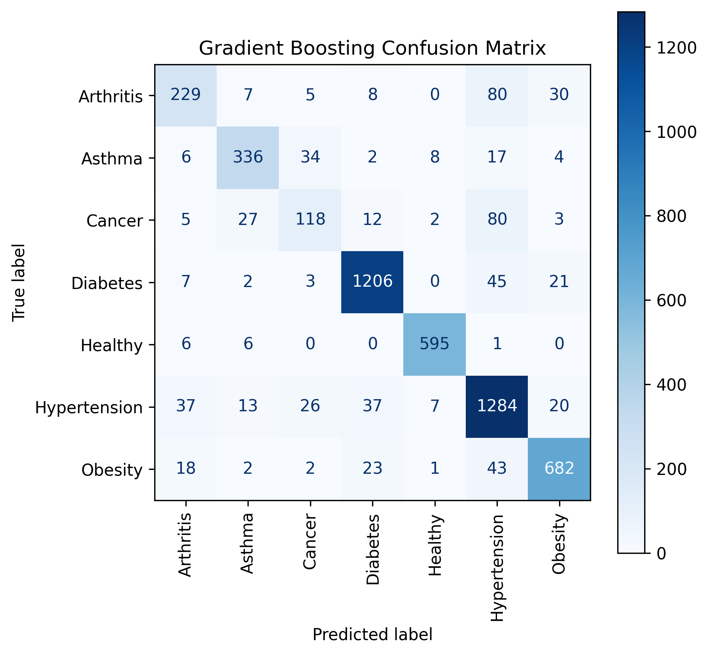
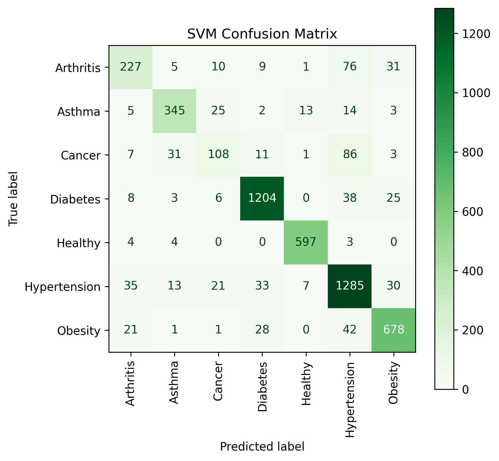

# Healthcare Risk Factors Prediction

## Overview

This project aims to predict an individual’s health condition based on demographic, behavioral, and physiological factors using the Healthcare Risk Factors Dataset (contains health records inspired by WHO data, supplemented with synthetic examples for completeness).
The task is a multiclass classification problem, with the goal of identifying the likely health condition of each individual (e.g., diabetes, obesity, asthma, hypertension, cancer, etc.).

## Summary of Insights

A thorough exploratory data analysis revealed several key trends and medically consistent patterns across demographic and health-related variables:

#### General Population Trends

- `Glucose` and `HbA1C` levels show a sharp **increase** between **ages 40–75**, indicating higher diabetes risk.
- `Blood Pressure and Cholesterol` both **increase** steadily **with age**, consistent with cardiovascular risk accumulation.
- `BMI` **increases** between **25–30** years old, then **gradually declines** in older age groups.
- `Triglycerides` follow a **similar** pattern to `cholesterol`, reflecting metabolic risk.
- `Physical Activity, Diet Score, and Sleep Duration` all **decline with age**, while `Stress Levels` exhibit a clear **upward trend**.
- `Smoking and Alcohol Consumption` showed **no significant relationship with age**

#### Condition-Specific Insights

- `Diabetes`: **elevated** `Glucose and HbA1C levels`, often accompanied by a `family history`.
- `Obesity`: Marked by **higher** `BMI and Triglycerides`, and frequently overlapping with `Hypertension and Elevated Cholesterol`.
- `Asthma`: Patients displayed noticeably **lower** `Oxygen Saturation`.
- `Hypertension`: Predominantly found among **older adults** with **high** `Cholesterol and Blood Pressure`.
- `Cancer`: **longer** `hospital stays` observed and **higher** `stress levels`.
- `Arthritis`: **Similar** to `hypertension`, more prevalent in **older individuals**.
- `Healthy individuals`: Exhibited the **lowest** values across `Glucose, HbA1C, Cholesterol, BMI, and Stress Levels`, and the **highest** values for `Physical Activity, Diet Score, and Sleep Duration.`

#### Demographic Distribution

- **No young patients** were identified with `diabetes or hypertension`.
- `Healthy` individuals ranged broadly from 20 to 70 years old.
- `Asthma` appeared across ages 10–60, indicating a more **evenly** distributed condition.
- `Cancer` affected a **wide range**, from 30s to 80s.
- `Arthritis and Hypertension`concentrated in **older populations**.

**Feature Importance Insight:** Length of Stay, though highly correlated with the target, was excluded to prevent data leakage, ensuring a realistic predictive model.

## Modeling & Results

To handle class imbalance, Stratified K-Fold Cross-Validation was used throughout training.
Five models were initially benchmarked. Gradient Boosting and SVM were selected, based on performance and generalization, for fine-tuning using Randomized Search.

After retraining with optimal hyperparameters, both models achieved similar results on the test set:

Gradient Boosting → Accuracy: 0.87 • Macro Recall: 0.81 • Macro F1: 0.82 • Macro Precision: 0.84  
SVM               → Accuracy: 0.87 • Macro Recall: 0.80 • Macro F1: 0.82 • Macro Precision: 0.83

The confusion matrices for both models are shown below:

Both models perform similarly. GB slightly outperforms SVM in recall and F1, making it the preferred model for balanced multiclass prediction.

**Hypertension** is the most common misclassified condition, likely due to dataset imbalance and overlapping features with other conditions (general prevalence makes it easier to confuse with similar profiles).

## Recommendations & Next Steps

- Class Balancing: Apply oversampling/undersampling or synthetic sampling (e.g SMOTE) to underrepresented/overrepresented conditions to reduce misclassification bias and improve predictive accuracy across all classes.

- Feature Engineering: Introduce interaction terms (e.g., BMI × Age) or domain-informed derived features to capture more nuanced health patterns, potentially improving model discriminative power.

- Ensemble Methods: Experiment with model stacking or blending (e.g., combining GB and SVM outputs) to leverage complementary strengths of different algorithms.

- Hyperparameter Optimization: Extend search using GridSearch for finer tuning, aiming for improved predictive performance while avoiding overfitting.

